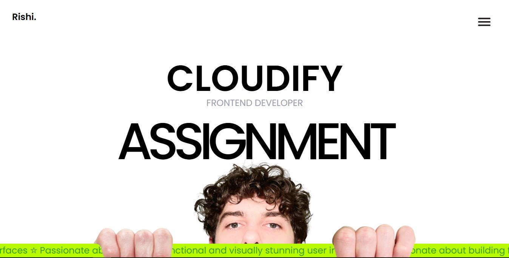
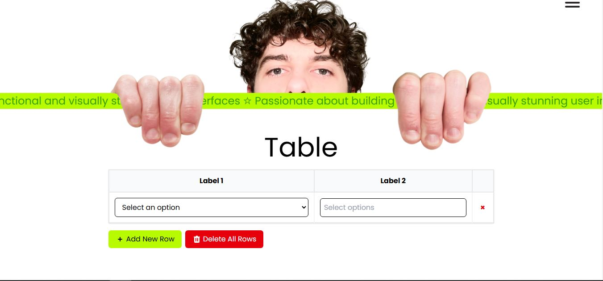

# Cloudify (Frontend Assignment)

### Landing Page


### Table UI


## Project Overview

This project is a frontend assignment form **Cloudify**, built using **React, Vite, Tailwind CSS and Framer Motion**. The goal was to create a functional and visually appealing table with various interactive elements.


## 📌 Table Features

### 1️⃣ Column 1 (Single Select Dropdown)
- Contains a **single select dropdown** with a static list of options.
- Once an item is selected, it **cannot be reselected** in the subsequent rows.

### 2️⃣ Column 2 (Multi-Select Dropdown)
- Contains a **multi-select dropdown** that allows selecting multiple options.
- Includes an **"Add New Item"** component at the bottom of the dropdown for adding custom options.

### 3️⃣ Add New Row Button
- Clicking the **"Add New Row"** button adds a new row to the table.
- Each new row follows the constraints set for Column 1 and Column 2.

---

## ✅ Completed Features

- Implemented **single select dropdown** for Column 1.
- Prevented duplicate selections in different rows.
- Created a **multi-select dropdown** for Column 2.
- Integrated **"Add New Item"** functionality inside the second dropdown.
- Added **"Add New Row"** button.
- Maintained **data consistency** across dropdowns.
- Designed a **responsive** layout for different screen sizes.

## 🎁 Additional Features Implemented

1. **Local storage persistence** (Refresh support).
2. **"Select All" functionality** in multi-select dropdown.
3. **Input validation & error handling** (prevents adding duplicate items).
4. **Click-outside detection** for dropdowns to close.
5. **Keyboard accessibility** for navigation through dropdown.
6. **Clear Error feedback** for user actions.
7. **Delete button** (×) for each row.
8. **"Delete All Rows" button** with a trash icon.

---

## 🛠️ Installation and Setup

### Prerequisites
Ensure you have the following installed:
- [Node.js](https://nodejs.org/) (Recommended: Latest LTS version)
- [Git](https://git-scm.com/) (Optional but recommended)

### 1️⃣ Clone the Repository
```sh
git clone <repository-url>
cd <project-folder>
```

### 2️⃣ Install Dependencies
```sh
npm install
```

### 3️⃣ Start the Development Server
```sh
npm run dev
```
The application should now be running at [**http://localhost:5173/**](http://localhost:5173/) (default Vite port).


---

## 📁 Project Structure

```
📦 assignment_deep_cloudify
├── 📂 src             # Main source code
│   ├── 📂 components  # Reusable UI components
│   ├── 📂 hooks       # Custom React hooks
│   ├── 📂 utils       # Utility functions
│   ├── 📜 App.jsx     # Main App component
│   ├── 📜 main.jsx    # Entry point
│   ├── 📜 index.css   # Global styles
├── 📜 package.json    # Project metadata & dependencies
├── 📜 tailwind.config.js  # Tailwind CSS configuration
├── 📜 vite.config.js  # Vite configuration
├── 📜 .gitignore      # Git ignore file
├── 📜 README.md       # Project documentation
└── 📜 public          # Static assets
```

---

## 🔗 Useful Commands

| Command           | Description               |
| ----------------- | ------------------------- |
| `npm install`     | Install dependencies      |
| `npm run dev`     | Start development server  |

---


